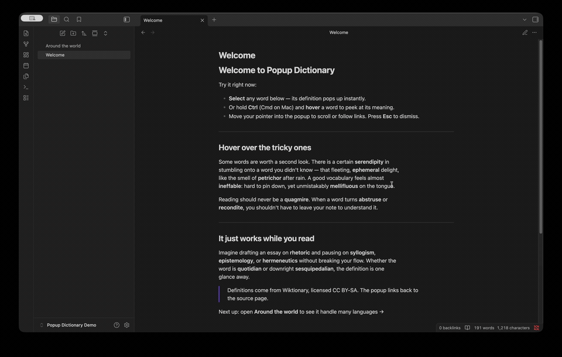

# Popup Dictionary

An [Obsidian](https://obsidian.md) plugin that shows a word's definition in a small
popup when you **select** a word or **Ctrl-hover** it. Definitions come from
[Wiktionary](https://www.wiktionary.org/), so it works across a very large number of
languages.



## Features

- **Selection lookup** — select a word and run the *Look up selected word* command
  (bind it to a hotkey), or enable automatic lookup on every selection.
- **Hover lookup** — hold **Ctrl** (configurable) and hover a word to see its
  definition after a short delay. Move into the popup to scroll or click links.
- **Many languages** — word boundaries are detected with
  [`Intl.Segmenter`](https://developer.mozilla.org/docs/Web/JavaScript/Reference/Global_Objects/Intl/Segmenter),
  so even scripts without spaces between words (Chinese, Japanese, Thai, Khmer, …)
  are handled. Definitions are returned grouped by language.
- **Configurable** — Wiktionary edition / gloss language, a language allow-list,
  examples on/off, number of senses, hover delay and modifier key.
- Theme-aware popup styling; results link back to the Wiktionary page.

## How it works

For each lookup the plugin calls the Wiktionary REST API:

```
https://<edition>.wiktionary.org/api/rest_v1/page/definition/<word>
```

The response is an object keyed by language code; each language has parts of speech
and HTML definitions. The "edition" you choose (default `en`) is both the wiki queried
**and** the language the definitions are written in — e.g. set it to `fr` to read
French-language definitions. The English edition is the broadest: it defines words
from thousands of languages, with English glosses.

> Definitions are © Wiktionary contributors, licensed
> [CC BY-SA](https://creativecommons.org/licenses/by-sa/4.0/). The popup links back to
> the source page.

## Build

This plugin ships as TypeScript source and must be compiled once. You need
[Node.js](https://nodejs.org/) 18 or newer.

```bash
npm install      # install dev dependencies
npm run build    # type-check and bundle to main.js
```

For active development use `npm run dev`, which rebuilds `main.js` on every change.

### Develop in a container (no local Node needed)

A [dev container](https://containers.dev/) is included, so you don't have to install
Node on your host — only Docker.

- **VS Code:** open the folder and choose *Dev Containers: Reopen in Container*. The
  container (`mcr.microsoft.com/devcontainers/javascript-node`) runs `npm install`
  automatically; then run `npm run build` or `npm run dev` in its terminal.
- **Plain Docker:** from the project folder,

  ```bash
  docker run --rm -u node \
    -v "$PWD":/workspaces/app -w /workspaces/app \
    node:20-bookworm-slim \
    bash -lc "npm install && npm run build"
  ```

  `main.js` is written back to the project folder via the bind mount, ready to copy
  into your vault.

## Installation

### From the Community Plugins browser (once published)

In Obsidian: **Settings → Community plugins → Browse**, search for *Popup Dictionary*,
install, and enable it.

### Manually (from a release or your own build)

Copy these three files into your vault:

```
<your-vault>/.obsidian/plugins/popup-dictionary/
├── main.js
├── manifest.json
└── styles.css
```

Then in Obsidian: **Settings → Community plugins**, reload, and enable
**Popup Dictionary**. (During development you can instead symlink the project folder to
that location so rebuilds are picked up automatically.)

## Usage

- **Selection:** select a word, then run **Look up selected word** from the command
  palette. Assign a hotkey under *Settings → Hotkeys* for one-key lookups. Or set
  *Selection trigger → Automatic on selection* to pop up whenever you select a word.
- **Hover:** hold **Ctrl** and hover over a word; the definition appears after the
  configured delay. Move the pointer into the popup to scroll or follow links.
- **Dismiss:** press **Escape**, click outside the popup, or scroll the note.

## Settings

| Setting | Default | Description |
| --- | --- | --- |
| Wiktionary edition | `en` | Wiki to query and the language of the definitions. 2–3 letter code (`en`, `fr`, `el`, `ja`, …). |
| Show only these languages | *(all)* | Comma-separated language codes to display (e.g. `en, el, ja`). Empty shows everything. |
| Selection trigger | Command / hotkey | Whether selecting a word looks it up automatically or only on command. |
| Enable hover lookup | on | Show definitions on hover (desktop only). |
| Hover modifier key | Ctrl / Cmd | Key to hold while hovering. `None` triggers on hover alone. |
| Hover delay | 300 ms | How long to rest on a word before lookup. |
| Show examples | on | Include example sentences when available. |
| Max definitions per part of speech | 5 | Cap the number of senses shown. |

## Network use & privacy

To fetch definitions, the plugin sends the word you look up (and your chosen Wiktionary
edition) over HTTPS to Wikimedia's Wiktionary REST API at
`https://<edition>.wiktionary.org`. Nothing else is collected, stored remotely, or sent
anywhere; results are cached only in memory for the current session, and lookups fail
gracefully when you are offline.

## Notes & limitations

- **Requires an internet connection** (live Wiktionary API). Lookups are cached
  in-memory during a session.
- **Hover is desktop-only.** On mobile, use selection lookup.
- Language is inferred from the word itself (Wiktionary returns every language that
  spells the word that way) — single short words can be ambiguous across languages;
  use the language allow-list to focus the results.
- The hover/selection listeners are attached to the main window; notes opened in a
  separate pop-out window are not covered yet.

## Project layout

```
src/
├── main.ts           plugin lifecycle, event wiring, command, orchestration
├── settings.ts       settings interface, defaults, settings tab UI
├── dictionary.ts     Wiktionary client: fetch, parse, in-memory cache
├── wordDetection.ts  caret/selection → word, via Intl.Segmenter
└── popup.ts          floating popup: render, position, dismiss
```

## License

MIT
